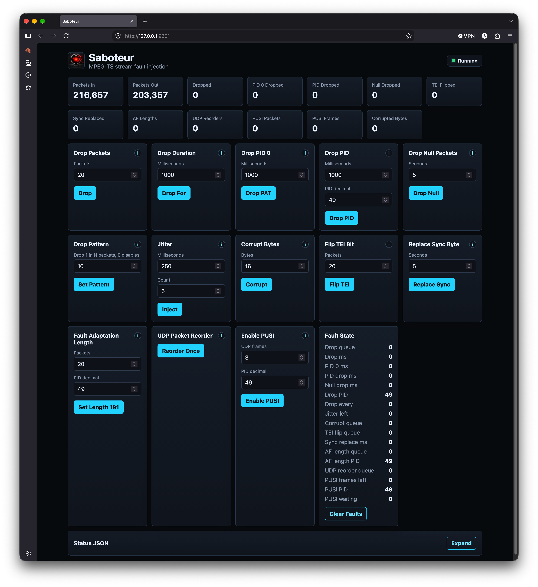

# Saboteur

Saboteur is a small MPEG-TS stream damage harness. It reads from an FFmpeg URL
such as UDP or SRT, forwards bytes to another FFmpeg URL, and exposes a tiny
REST/Web UI for triggering faults while another project is consuming the output.



## Build

Install FFmpeg development headers with `libavformat` and `libavutil` available
to `pkg-config`, then build:

```sh
cmake -S . -B build -DCMAKE_OSX_ARCHITECTURES=arm64
cmake --build build
```

## Run

```sh
./build/saboteur \
  --input-url 'udp://239.10.10.10:5000?overrun_nonfatal=1&fifo_size=5000000' \
  --output-url 'udp://127.0.0.1:6000' \
  --http-port 9601 \
  --add-latency 100
```

Open `http://127.0.0.1:9601/` for the web UI.

`--add-latency` is optional and buffers complete output UDP payloads for the
given number of milliseconds before sending them. The configured value is
exposed as `latency_ms` in `/api/status`.

The web UI is served from `webroot/`. For now, run the binary from the project
root so the built-in HTTP server can find `webroot/index.html`, `styles.css`,
and `app.js`. The UI renders its cards with local browser-native Web Components,
so it does not require a frontend build step.

## REST API

All commands are immediate and can be invoked while forwarding is active.

```sh
curl -H 'Content-Type: application/json' -d '{"packets":20}' 'http://127.0.0.1:9601/api/drop'
curl -H 'Content-Type: application/json' -d '{"ms":1000}' 'http://127.0.0.1:9601/api/drop_for'
curl -H 'Content-Type: application/json' -d '{"ms":1000}' 'http://127.0.0.1:9601/api/drop_pid0_for'
curl -H 'Content-Type: application/json' -d '{"ms":1000,"pid":49}' 'http://127.0.0.1:9601/api/drop_pid_for'
curl -H 'Content-Type: application/json' -d '{"seconds":5}' 'http://127.0.0.1:9601/api/drop_null_for'
curl -H 'Content-Type: application/json' -d '{"n":10}' 'http://127.0.0.1:9601/api/drop_every'
curl -H 'Content-Type: application/json' -d '{"ms":250,"count":5}' 'http://127.0.0.1:9601/api/jitter'
curl -H 'Content-Type: application/json' -d '{"bytes":16}' 'http://127.0.0.1:9601/api/corrupt'
curl -H 'Content-Type: application/json' -d '{"packets":20}' 'http://127.0.0.1:9601/api/flip_tei'
curl -H 'Content-Type: application/json' -d '{"seconds":5}' 'http://127.0.0.1:9601/api/replace_sync_for'
curl -H 'Content-Type: application/json' -d '{"packets":20,"pid":49}' 'http://127.0.0.1:9601/api/fault_adaptation_length'
curl -H 'Content-Type: application/json' -d '{}' 'http://127.0.0.1:9601/api/udp_packet_reorder'
curl -H 'Content-Type: application/json' -d '{"frames":3,"pid":49}' 'http://127.0.0.1:9601/api/enable_pusi_for'
curl -H 'Content-Type: application/json' -d '{}' 'http://127.0.0.1:9601/api/reset'
curl 'http://127.0.0.1:9601/api/status'
```

The current packet unit is one MPEG-TS packet: 188 bytes. Input reads are
packetized into 188-byte MPEG-TS packets before faults are applied, so PID-aware
tests work even when the underlying read size is not exactly packet-aligned.
